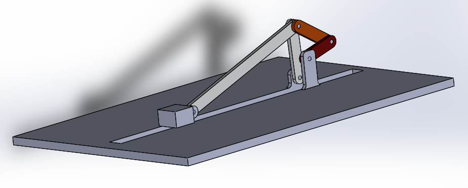

# BTP

This work titled as "Design and Fabrication of Experiment for Dynamic Analysis of Mechanisms " has been undertaken jointly by [Aakash Yadav](http://nimrobotics.github.io/) and Akhil Akunuru under the guidance of [Prof. Sriram Sundar](https://iittp.ac.in/dr-sriram-sundar).
|website| GitHub |
|--|--|
| https://nimrobotics.github.io/BTP/ | https://github.com/nimRobotics/BTP |

# Motivation and objective

The study of the *"Kinematics and Dynamics of Machinery" (IITT course
code: ME2206)* lies at the very core of a mechanical engineering
background. Although, little has changed in the way the subject is
presented, our methodology brings the subject alive and current. We
present the design and fabrication of a novel experimental setup for
carrying out static, kinematic and dynamic analysis of three different
mechanisms in a single setup (Figure [\[cad\_ful\]](#cad_ful)). The
mechanism is designed to be configurable to three different types of
mechanisms namely - double crank, slider crank and a six bar mechanism
depending on the use case as shown in Figure [\[cad\_all\]](#cad_all).
The mechanism has retrofitted parts (different link lengths and sliders)
to facilitate multiple experiments in the same setup.

The learner gets to "play" with the mechanism parameters and immediately
understand their effects. This will enhance one’s grasp of the concepts
and the development of analytical skills. Hence greatly supplementing
and reinforcing the theoretical understanding of the undergraduate
students taking the course.

